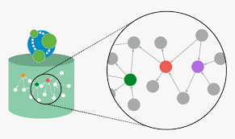

#  BUP & Health-care schema

<a href="https://www.legosoft.com.mx"></a>
Python microservice that generates Cypher queries this Chat GPT4 on any graph schema. The `chat-gpt`  front microservice.

The algorith is based in the article:

https://medium.com/neo4j/generating-cypher-queries-with-chatgpt-4-on-any-graph-schema-a57d7082a7e7

We used two Neo4j databases: one the BUP database and this second one is the `Health-care` database that is declared
in GDS project in Neo4j SandBox..

This microservice works with the `chat-gpt` microservice which is the one to use the API rest defined
in this microservice using `Flask` . The way they communicate is using REST calls without security.

### Running in a IDE environment

When the `bup-schema` microservice is run inside the IntelliJ we need to add the next lines:

<it runs using the Python 3.10 `bup-schema` environment defined in Ananconda.

## Introduction

Large language models have great potential to translate a natural language into a query language. For example, some 
people use GPT models to translate text to SQL, while others use GPT models to construct SPARQL queries. In this
microservice we explore how to translate natural language to Cypher query language.

There are two approaches to developing an LLM flow that constructs Query statements. One option is to provide example 
queries in the prompt or use the examples to finetune an LLM model. However, the limitation of this approach is that it
requires some work to produce the Cypher examples upfront. Therefore, the example Cypher queries must be generated for 
each graph schema, and also ask the user if the answer was correct, if not, tune the model.

On the other hand, we can provide an LLM directly with schema information and let it construct Cypher statements based 
on graph schema information alone. Using the second approach, we could develop a generic Cypher statement model to 
produce Cypher statements for any input graph schema, as we eliminate the need for any additional work like generating 
example Cypher statements.

Of course the dependency of how `well` is defined the schema depends on the response from LLM model.

This POC shows `how to implement a Cypher statement-generating model by providing only the graph schema` information. 
The POC evaluates the model’s Cypher construction capabilities on two graphs with different graph schemas. Currently, 
the only recommended model to generate Cypher statements based on only the provided graph schema is GPT-4. Other models
like GPT-3.5-turbo or text-davinci-003 aren’t that great, and future development will find an open-source LLM model 
hat would be good at following instructions in the prompt and GPT-4.


## Run using the bash shell

First you have to go to the `/bup-schema` directory.

1. Build the Docker Pyhton image:

```bash
docker build -t bup-schema .
```

Or if we want to run it and create the container also (but at root directory) run:

```bash
bash start.sh 
```

2. Create the container with docker compose:

A better way it to create the container using dock-comse in order to stay in the proper group of
containers (i.e., `docker-gen-ai`) inside the docker desktop.

```bash
docker cd docker-gen-ai
docker docker-compose up
```

## Example questions done to this microservice:

### For BUP database:

- ¿Cuál es la compania con mas proveedores?
- ¿Quiénes son las personas que trabajan en la compania ACME SA de CV?
- ¿Que email tiene la persona Diego?
- ¿Quienes son solteros?    `wrong answer`

### From health-care database

- What are the top 5 side effects reported?
- What are the top 3 manufacturing companies with the most reported side effects?
- What are the top 3 manufacturing companies with the most reported cases?
- What are the top 5 drugs whose side effects resulted in death of patients as an outcome?


## References:

- Build a Chatbot on Your CSV Data With LangChain and OpenAI
https://betterprogramming.pub/build-a-chatbot-on-your-csv-data-with-langchain-and-openai-ed121f85f0cd
- Langchain4j-examples:
https://github.com/langchain4j/langchain4j-examples/tree/main
- Using LLaMA 2.0, FAISS and LangChain for Question-Answering on Your Own Data
https://medium.com/@murtuza753/using-llama-2-0-faiss-and-langchain-for-question-answering-on-your-own-data-682241488476
- Chroma vector store class:
https://api.python.langchain.com/en/latest/vectorstores/langchain.vectorstores.chroma.Chroma.html#langchain.vectorstores.chroma.Chroma.from_documents
- Chromadb
https://pypi.org/project/chromadb/
- ChatGPT documentation
https://platform.openai.com/docs/models/overview
- 

Where the packages are: 


### Contact AI Legorreta

Feel free to reach out to AI Legorreta on [web page](https://legosoft.com.mx).


Version: 1.0.0
©LegoSoft Soluciones, S.C., 2024